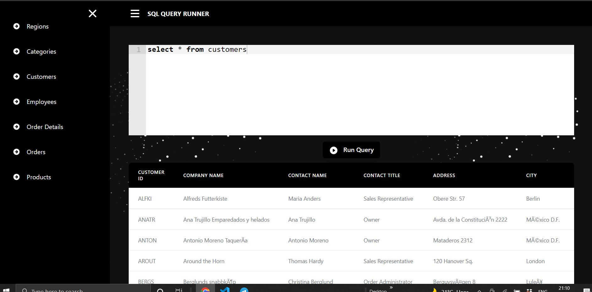
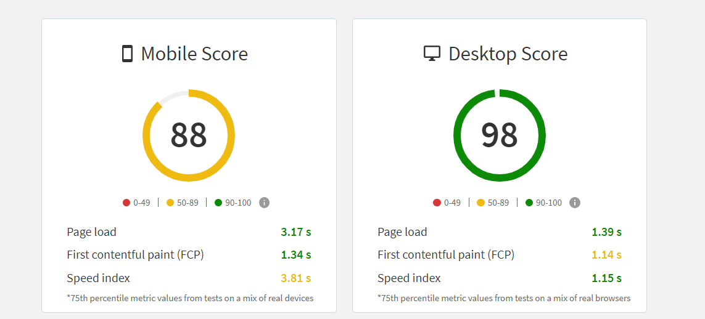

# SQL React Editor

##  Demo

website : [ Editor](https://sql-react-editor.vercel.app/)

##  Tech Stack

## SQL Queries

- `select * from customers`  
- `select * from categories`  
- `select * from employee`  
- `select * from order_details`  
- `select * from orders`  
- `select * from products`  
- `select * from regions`  

##  Page Load Time

I calculated the performance and load time of this website using BrowserStack SpeedLab.

## Optimaztion

- Used  `React.Lazy()` and `Suspense`  for faster page load.
- Used `React.Memo()` to optimize the render performance of functional components.
- Used vercel to deploy this website.

